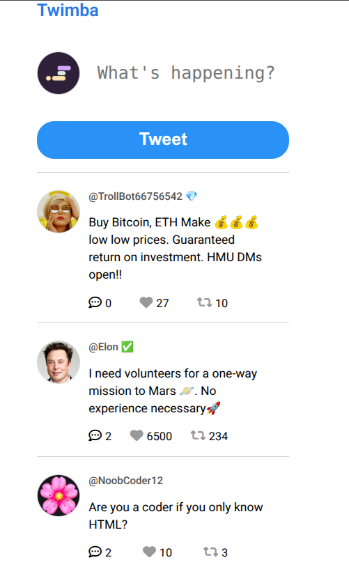

# Twimba

Twimba is a simple Twitter-like social feed built with vanilla JavaScript, HTML, and CSS. Users can view tweets, like, retweet, reply, and post new tweets. The project is designed for educational purposes and demonstrates basic front-end interactivity and DOM manipulation.

## Features

- View a feed of sample tweets with user handles and profile pictures
- Like and retweet tweets with instant UI updates
- Expand and collapse replies to tweets
- Post new tweets using the input box

## Project Structure

## Getting Started

1. **Clone or download the repository.**
2. **Open `index.html` in your browser.**
3. **Start tweeting!**

No build tools or server required.

## Dependencies

- [Font Awesome](https://cdnjs.cloudflare.com/ajax/libs/font-awesome/6.2.0/css/all.min.css) for icons
- [Google Fonts - Roboto](https://fonts.google.com/specimen/Roboto)
- [uuid](https://jspm.dev/uuid) (via CDN) for generating unique tweet IDs

## Screenshots

## License

This project is for educational purposes.
